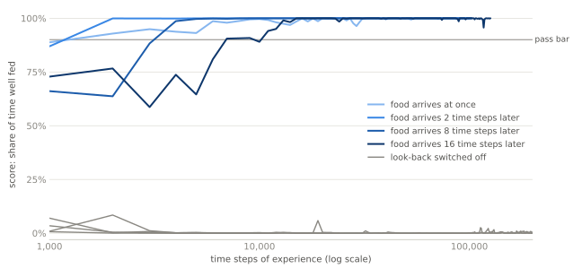
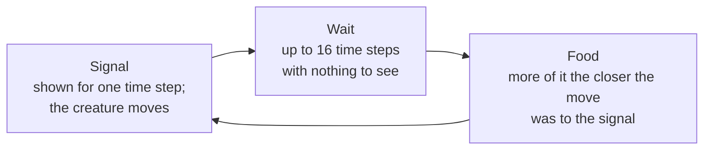

# predictive-coding-agent

**A small neural network that learns to act now for a payoff that comes later.** Nobody gives it a score, and it
never tries moves at random. It is built with one goal, to keep one thing it senses (how full it is) in a
comfortable range, and it learns the rest by predicting what it will sense next and correcting its own mistakes.

> **For researchers.** The agent learns one-step predictions on two clocks, every tick and its own events, and
> sets its action at decision time by gradient descent on a preference cost through those predictions. In
> reinforcement-learning terms it is an on-policy Monte Carlo forecast of the change in one interoceptive
> variable up to the next event, with action through the learned forward model. No reward is delivered and no
> value is bootstrapped. It is not active inference in the full sense: no free-energy functional is defined.
> [The precise claims and their limits](#for-researchers)

<picture>
  <source media="(prefers-color-scheme: dark)" srcset="docs/summary-dark.svg">
  
</picture>

*What to see: the full agent (blue) climbs past the pass bar and stays there, at each of four delays between
its move and its food. With one part switched off (gray, the same four delays), it stays at the bottom. The
score is the share of the time the agent keeps itself well fed, counted over 32 copies of it that learn together
and share one brain. Each blue line is the average of three runs that start from random weights, and each gray
line is one run. A point covers 1,000 time steps, so learning that happens inside the first 1,000 does not show.
The part switched off is the look-back explained below.*

## In plain words

**The task.** A simulated creature slowly gets hungry. A signal appears for a single time step and shows it
which way to move. The closer its move is to that direction, the more food it gets, but the food arrives up to
16 time steps later, and nothing happens in between. Then the next signal appears. One round, from signal to
food, is a *trial*. The creature is told none of this. It has to find out that the signal matters, which move
goes with it, and that food arriving now was caused by a move it made a while ago.



**Why that takes something extra.** By the time the food arrives, the moment that earned it is gone, so
something has to connect the two. Learning methods usually do it with a fading record of recent moves, or by
learning how much future reward each situation is worth. This creature keeps one snapshot instead: the last
moment that surprised it.

**How the creature does it.** It is a small neural network, under 800 lines of Python.

- **It has a goal, but gets no score.** It senses how full it is, and it is built with one goal for that sense:
  keep it in a comfortable range and, looking ahead, near the middle of that range. Nothing tells it how good a
  move was, and the goal is never used to teach it. The goal only steers its movement.
- **It learns by predicting.** At every time step it predicts what it will sense next, including how its
  fullness will change. When a prediction turns out wrong, the mistake adjusts its connections. That is the
  only way it learns.
- **It works out its move from its predictions.** Its predictions depend on how it moves. So it asks which way
  of moving would, by its own predictions, bring its fullness back toward the comfortable range, and it turns
  that way. At first its moves are whatever its random starting connections produce. As the predictions
  improve, the moves improve with them. It never tries a move just to see what happens.
- **One memory bridges the delay.** It remembers the last moment that surprised it, which means a moment when
  what it saw was not what it had predicted. In this task that is the moment of the signal. It keeps what it
  saw and did at that moment, and how full it was. At the next surprise it looks back and measures how its
  fullness really changed in between. If that is not what it expected at the remembered moment, it corrects
  the expectation. The next time the same signal meets the same move, it expects the food, or the lack of it,
  already when it moves, and its goal steers by that. This look-back is called the *hindsight correction* in
  the rest of this page.

**The result.** Starting from random weights, the agent learned its task in all 27 runs: the task above at
seven delays, and a second task with two needs. It kept it for the rest of each run, at least 100,000 more time
steps. Longer delays took longer to learn. At a delay of 1 a copy of the creature went hungry for about 20
trials on average before the task was learned, and at a delay of 16 for about 90 to 160.

With the look-back switched off, the agent never learned the task. That shows it depends on the look-back. It
does not show that the delay is the reason: the switched-off agent also failed with no delay at all, and why
was not tracked down.

**What this is, and is not.** It is a small proof of concept, not a benchmark result. A standard method, given
a reward, would be expected to solve a task of this size, and none was run here. What it shows is narrower: an
agent whose only goal is a preferred range for one thing it senses can learn that a signal, a move and a later
outcome belong together, in a task where each outcome follows one decision.

## Results

From here on a time step is called a *tick*. The agent played two games. The *cue game* is the task above,
run at seven delays from 0 to 16 ticks. In the *two-need game* the creature has two needs, food and water,
offered in two different directions on every trial. A bite can overfill a need, so the right move is sometimes
to take less, or nothing. Each combination was run three times from different random weights.

How a run is judged:

- The **score** is the share of the agent's 32 copies that are inside the comfortable range, averaged over each
  1,000 ticks. (The code and the pages under `docs/` call the copies *bodies* and the range the *comfort band*.)
- The **pass bar** is set 90% of the way from a floor to the score of a perfect player. The floor is the best
  score of a player that does not use what the game is about: the signal in the cue game, its own fullness in
  the two-need game.
- A run has **mastered** a game when three 1,000-tick windows in a row are at or above the bar.

<!-- summary:begin -->
| Game | Delay (ticks) | Runs that mastered it and held it | Ticks to mastery, in each run |
|---|---|---|---|
| cue | 0 | 3 of 3 | 1,000, 6,000, 1,000 |
| cue | 1 | 3 of 3 | 1,000, 1,000, 1,000 |
| cue | 2 | 3 of 3 | 2,000, 2,000, 2,000 |
| cue | 4 | 3 of 3 | 3,000, 2,000, 1,000 |
| cue | 8 | 3 of 3 | 4,000, 4,000, 3,000 |
| cue | 12 | 3 of 3 | 6,000, 6,000, 4,000 |
| cue | 16 | 3 of 3 | 13,000, 6,000, 11,000 |
| two-need | 1 | 3 of 3 | 1,000, 1,000, 1,000 |
| two-need | 2 | 3 of 3 | 1,000, 1,000, 1,000 |
<!-- summary:end -->

- **All 27 runs mastered the game and held it** for the rest of the run, 100,000 ticks or more.
- **A longer delay took longer to learn.** Mastery took 1,000 to 13,000 ticks, which is seconds to a few minutes
  of computing on one CPU core. Before mastery a copy spent, on average, 16 to 22 trials outside its comfortable
  range at a delay of 1, and 89 to 160 trials at a delay of 16.
- **After mastery the score stayed up.** Across all runs, 2,983 windows of 1,000 ticks came after mastery. The
  score was below the bar in one of them.
- **The control never mastered a game.** The same agent with the hindsight correction switched off was run five
  times. None reached the bar, including one with no delay at all.

The full tables, the control and what it does not show, and every curve are in
[docs/results.md](docs/results.md). The agent published here was also checked, tick for tick, against the
research program that produced the curves:
[how the numbers were checked](docs/results.md#how-the-numbers-were-checked).

## For researchers

**The claim.** An agent whose only objective is a preferred range for one interoceptive variable learns a
contingency between a cue, an action and a delayed outcome from prediction errors alone, in tasks where events
are sparse and one outcome follows one decision. No reward is delivered, no value is bootstrapped, no noise is
added to actions and no error is sent back through time. These games are easy for reinforcement learning when a
reward is given, and no baseline was run.

**In reinforcement-learning terms.** The outcome forecast is a general value function on an event clock: an
on-policy Monte Carlo prediction of one cumulant, the change in fullness, up to the next event. It is split
into a baseline fitted across the bodies and a part read from the state. The remembered moment is a one-slot
eligibility trace. The action is a point estimate, found at decision time by gradient descent on a quadratic
cost of that forecast through the learned forward mapping (compare Jordan and Rumelhart, 1992). In the cue game the
forecast is functionally a value. [Reinforcement learning](docs/theory.md#reinforcement-learning)

**Against predictive coding and active inference.** The agent keeps their outline: the senses drive the state
only as prediction errors, every weight learns from a prediction error, and no policies are compared. Its
goals are prior preferences in form: the cost the movement descends is the expected negative log of a preferred
density over the predicted fullness, which is the pragmatic value of Friston et al. (2015). It is neither in
textbook form. The preferences steer only the movement and do not enter perception, so no free-energy functional
is shared between the two, and none is defined. Nothing is epistemic, and no precision is estimated: the one on
the setpoint is set by hand.
[Predictive coding](docs/theory.md#predictive-coding) · [Active inference](docs/theory.md#active-inference)

What may be worth a closer look:

- **Prediction and preference are kept apart.** The weights learn to predict the fullness. No weight learns
  from the cost: the setpoint is applied only when the agent acts. A change of setpoint should therefore change
  behavior before anything is relearned, which a cached value would not do. This was not tested.
  [In words](docs/how-it-works.md#the-goal-is-a-preferred-range) ·
  [in equations](docs/equations.md#the-two-preferences)
- **Action through the model, with no policy and no sampling.** While the state settles, the movement turns
  along the gradient of the cost, carried through the forecast weights to the active units and from there
  through the transpose of the movement's own input weights. Those weights are trained by prediction errors, so
  that is where the mapping from cue to movement is learned. The gradient is approximate: 40 annealed steps,
  with lateral inhibition and thresholds treated as fixed.
  [In words](docs/how-it-works.md#the-movement-is-optimized-not-selected) ·
  [in equations](docs/equations.md#the-movement)
- **A delayed outcome is attributed to the latest event.** A tick is an event when sight or movement was
  predicted neither by the forecast nor by its running mean. The state stored at one event is given, at the
  next, the measured change in fullness as its target. In these games the events are exactly the cue ticks, so
  segmentation by prediction error was not put to a test.
  [In words](docs/how-it-works.md#anticipation-corrected-in-hindsight) ·
  [in equations](docs/equations.md#events-outcomes-and-the-hindsight-error)
- **Regulation is anticipatory, toward a fixed setpoint.** The movement at a cue is set by a learned forecast
  of where the fullness will be at the next event, so a move that gives up the next meal is already wrong when
  it is made.
  [In words](docs/how-it-works.md#the-anticipation-has-a-setpoint-of-its-own) ·
  [relation to interoceptive inference](docs/theory.md#active-inference)
- **One ablation, and what it does not show.** With the hindsight correction off, no run reaches the bar. That
  includes the run with no delay, where nearly every tick is an event and the two forecasts have the same
  target. So the ablation shows that the agent needs the event path as it is built: its fixed gain, its point
  setpoint, its faster rate and its step into the input weights. It does not show that reaching across the
  delay is what that path contributes.
  [The control](docs/results.md#the-control)
- **What is built in by hand.** The cost and its setpoint, a privileged interoceptive channel, three
  hand-shaped gains (none is an inverse variance), a learning-rate gate, a baseline fitted across the 32
  bodies, and about 40 constants chosen on these two games.
  [What is built in](docs/limits.md#what-is-built-in) ·
  [what would test it further](docs/limits.md#what-would-test-it-further)

## How it works

1. **Predict.** A sparse internal state (256 threshold units) predicts the next tick's senses, including the
   change in fullness. The error of that prediction drives the next state, and every weight learns from a
   prediction error.
2. **Settle.** On each tick the state is found by a short relaxation in which units with overlapping inputs
   compete. A second, smaller level predicts the first.
3. **Act.** During that settling the agent reads the slope of its preference at the fullness it forecasts,
   and turns its movement the way that would bring the forecast back toward the comfort range. Nothing is
   searched or sampled.
4. **Remember one moment.** A tick is eventful when what the agent saw or did was news to it. Each body keeps
   its latest eventful moment: its state then, and its fullness.
5. **Correct in hindsight.** At the next eventful moment the agent measures how its fullness changed since the
   remembered one, and corrects what that moment should have forecast. The forecast has a setpoint of its own,
   so a move that would give up the next meal already looks wrong when it is made.

Every part in words: [docs/how-it-works.md](docs/how-it-works.md). Every update rule:
[docs/equations.md](docs/equations.md).

## Try it

```bash
git clone https://github.com/cabloo/predictive-coding-agent
cd predictive-coding-agent
pip install torch --index-url https://download.pytorch.org/whl/cpu
python -m pcagent.run --game cue --delay 2 --seed 1
```

```text
cue game, delay 2, seed 1: oracle 1.0000, floor 0.0016, bar 0.9002
tick    1000  score 0.887  below  (73 ticks/s)
tick    2000  score 1.000  at or above the bar  (73 ticks/s)
tick    3000  score 1.000  at or above the bar  (73 ticks/s)
...
tick  102000  score 1.000  at or above the bar  (74 ticks/s)
mastered at tick 2000; held >= 100000 ticks, R >= 50.0; held: yes
```

The last line says that the run mastered the game at tick 2,000 and then stayed at or above the bar for 100,000
ticks. `R` is the second number divided by the first, and a game counts as held when `R` is at least 10.

The agent runs at 50 to 75 ticks per second on one CPU core, depending on the machine, so a run that masters
early and is then followed for 100,000 ticks takes about half an hour. Stop it earlier with `--ticks 5000`. Add
`--no-hindsight` for the control.

In code, the agent needs nothing from a game except its three senses:

```python
from pcagent import Agent, CueGame

game = CueGame(32, seed=1, delay=4)                # 32 bodies, the outcome 4 ticks after the answer
agent = Agent(game.n_extero, game.n_proprio, game.n_intero, seed=1)
for tick in range(10_000):
    movement = agent.step(game.extero(), game.proprio(), game.intero())
    game.step(movement)
print(game.score())                                # share of bodies in the comfort band
```

Tests: `pip install pytest`, then `pytest -m "not slow"` (under a minute) or `pytest` (adds two learning runs,
about two minutes).

## Limits

- **Two small games.** The senses are 5 to 8 numbers and the movement is a direction in a plane. Nothing here
  shows that the method scales.
- **No baseline.** A standard reinforcement-learning agent, given a reward, would be expected to solve both
  games. None was run.
- **The control does not isolate the delay.** It fails with no delay too, so it shows that the agent needs the
  hindsight path, not why.
- **The games hand the agent its events.** The eventful moments are exactly the signal ticks, and one outcome
  follows one decision. Finding events by surprise was not put to a test.
- **Holding back is barely tested.** In the cue game the fullness never rises past the setpoint, so more food
  is always right. Only the two-need game asks the agent to decline, and only at delays of 1 and 2 ticks.
- **A fixed, blank wait of at most 16 ticks.** Varying delays, longer delays and distractions during the wait
  were not tested.
- **One remembered moment.** An outcome is credited to the latest eventful moment only.
- **Much is set by hand, and there are three seeds.** The goal, a privileged sense of fullness, a baseline
  shared by the 32 copies, and about 40 constants that are the same for every run but were chosen on these two
  games.

The full list, and the experiments that would test the idea further: [docs/limits.md](docs/limits.md).

## In this repository

| Where | What |
|---|---|
| [`pcagent/agent.py`](pcagent/agent.py) | The agent: state, settling, the learning rules, anticipation and memory |
| [`pcagent/memory.py`](pcagent/memory.py) | When a tick is eventful, and the line that forecasts an outcome from the fullness |
| [`pcagent/worlds.py`](pcagent/worlds.py) | The two games, and the reference policies that set the floor and the oracle |
| [`pcagent/scoring.py`](pcagent/scoring.py), [`run.py`](pcagent/run.py), [`report.py`](pcagent/report.py) | The pass bar and mastery, the runner, and the tables |
| [`results/acceptance.json`](results/acceptance.json) | The 27 learning curves and the 5 control curves |
| [`docs/how-it-works.md`](docs/how-it-works.md) | Every part of the agent, in words |
| [`docs/equations.md`](docs/equations.md) | Every update rule, with the function that implements it |
| [`docs/results.md`](docs/results.md) | Full results, the control, and how the numbers were checked |
| [`docs/theory.md`](docs/theory.md) | Relation to predictive coding, active inference and reinforcement learning, with references |
| [`docs/limits.md`](docs/limits.md) | What was not shown, what is built in, and what would test it further |
| [`tests/`](tests) | The games, the scoring, the agent's invariants, and that these pages match the results file |

Every default of `Agent(...)` is the value the results were run with; its docstring says what each one does.

## License

[MIT](LICENSE).
