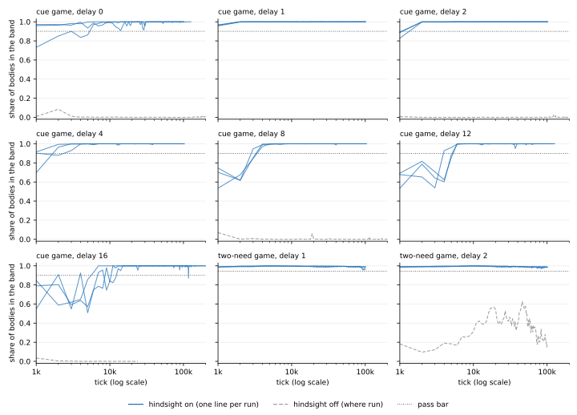
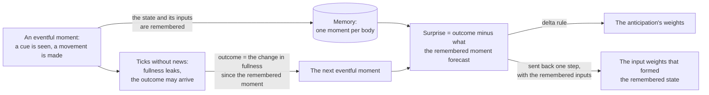

# predictive-coding-agent

A small agent that learns, from its own prediction errors, to act now for an outcome that arrives later.



*Each panel is one game at one delay. Each point is the mean score over 1,000 ticks, so where a curve starts
above the bar, the learning happened inside the first window. Blue: three runs from different random weights.
Gray (five panels): the same agent with its memory's corrections switched off, one run each. Dotted: the pass
bar.*

**What it does.** A body has a fullness level that leaks away. A cue says which way to move, and the right move
is paid with food up to 16 ticks later, with nothing to see in between. The agent's only goal concerns its own
fullness: keep it inside a range, and steer toward the middle of that range further ahead. Starting from random
weights, it learns to answer the cue and keeps doing so.
All 27 runs (9 combinations of game and delay, 3 random seeds each) reached the pass bar in 1,000 to 13,000
ticks. The bar is 90% of the way from the best policy that ignores what the game is about to a hand-written
perfect one. No run lost it afterward (three 1,000-tick windows in a row below the bar) for as long as it ran,
100,000 ticks or more. In all runs together, one window dipped below the bar after mastery.

**How it is built.** About 700 lines of plain tensor code in [`pcagent/agent.py`](pcagent/agent.py), run on one
CPU core. No reward comes from the environment: the only outcome the agent learns from is the change in its own
fullness, which it measures itself. There is no automatic differentiation, no backpropagation through time, no
list of candidate movements, no search, and no randomness once the first weights are drawn. Every weight learns
from a prediction error times that weight's input: the forecast weights by a
[delta rule](https://en.wikipedia.org/wiki/Delta_rule), the input weights from the same error sent back one
step through the forecast weights.

**The idea, in one paragraph.** The agent's forecast looks one tick ahead, and one-tick errors do not connect a
movement to food that arrives eight ticks later. So the agent forecasts one more quantity: how much its
fullness will change by the next eventful moment (a tick whose sight it did not predict). The part of that
forecast read from its state is the *anticipation*. A small memory holds the last eventful moment. When the next one arrives, the agent knows how much its fullness actually
changed in between, and in hindsight it corrects what the remembered moment should have forecast. The agent then
asks one thing of that forecast: that the fullness it expects at the next eventful moment sits in the middle of
its comfort band. The remembered moment is read for the correction only, and it never picks a movement. It sets
a target for one prediction at one earlier moment, and the same learning rules as everywhere else do the rest.
("Hindsight" names this one correction. It is not hindsight experience replay.)

## Contents

- [The task](#the-task)
- [How the agent works](#how-the-agent-works)
- [Quick start](#quick-start)
- [Results](#results)
- [Where these numbers come from](#where-these-numbers-come-from)
- [How it relates to predictive coding, active inference and reinforcement learning](#how-it-relates-to-predictive-coding-active-inference-and-reinforcement-learning)
- [Limits](#limits)
- [Code map](#code-map)
- [References](#references)
- [License](#license)

## The task

Time moves in ticks. On every tick the agent senses three things and returns a movement:

| Sense | What it is | Size |
|---|---|---|
| Sight | the cue, or blank | 2 or 4 numbers |
| Last movement | the direction the body just moved | 2 numbers |
| Fullness | one number per need | 1 or 2 numbers |

A trial lasts `delay + 1` ticks, and trials follow each other without a gap:

1. **Cue tick.** A direction is shown (east, north, west or south). The movement made on this tick is the answer.
2. **The wait.** Sight is blank for `delay` ticks, and movements do not change the outcome.
3. **The outcome.** At the end of the wait, fullness rises by an amount that depends on how close the answer was
   to the cue: all of the bite for the exact direction, half of it at 45 degrees off, none at 90 degrees or more.

Fullness leaks away on every tick. The agent's comfort band is 0.5 to 1.0, and the score is the share of bodies
whose fullness is inside the band. 32 bodies run in parallel and share one set of weights.

The agent is told none of the rules. It is not told that trials exist, how long the delay is, which tick carries
a cue, or what its score is. At any delay above 0, when the agent moves, no food arrives, and by the time it
does, the cue has been out of sight for `delay` ticks. One-tick prediction errors alone do not teach this agent
the task (see the control under [Results](#results)).

There are two games, both in [`pcagent/worlds.py`](pcagent/worlds.py):

- **The cue game.** One need, one cue. Tested at delays of 0, 1, 2, 4, 8, 12 and 16 ticks.
- **The two-need game.** Food and water are offered in two different directions on every trial. The body can take
  one, a share of each when the two are 90 degrees apart, or neither. A bite can push a need above the band, so
  declining is sometimes right. The two needs leak at different rates that change every 20 trials. The best of
  14 reference policies that ignore the body's fullness (among them eight fixed schedules of eating, drinking
  and skipping) scores 0.44 at a delay of 1 and 0.43 at a delay of 2, the two delays tested.

## How the agent works

One call to `Agent.step` is one tick. The code marks its parts as "Idea 1" to "Idea 12"; the same numbers are
given here.

**It predicts its next senses from a sparse state.** The state is 256 units, each with a threshold that adapts
toward the unit being active on about 6% of ticks. A linear forecast reads the state and predicts the next
tick's senses, and learns from its error by a normalized delta rule. The agent also computes the change in its
fullness since the last tick and forecasts it like a sense. The last movement is known, so it is copied, not
forecast. *(Ideas 1 and 2)*

**The state is found by settling.** On each tick the units are driven by the surprise, by the previous state
and by the movement. The surprise is this tick's senses minus what the previous state forecast for them (the
forecast's constant term is left out here; it is used when the weights learn and, for the change in fullness,
where the comfort band is read). Units whose input weights
overlap inhibit each other. Forty small steps of this relaxation give the state. The relaxation runs twice per
tick: once with the goal and the second level's prediction, which gives the movement and the state the forecast
reads, and once with neither and with that movement fixed, which gives the state that the second level
predicts and that memory stores. *(Idea 3)*

**The input weights learn from the forecast's error.** The error is sent back one step through the forecast
weights to the units that were active, and each of those units changes its input weights by that error times
the input it had. A second level of 64 units predicts the first level's state in the same way and sends its
prediction back down. *(Ideas 4 and 5)*

**The goal is a preferred range.** Outside the comfort band a cost grows with distance. The agent never
receives this cost. It reads the *slope* of the cost at the fullness it forecasts, averaged over how uncertain
that forecast is (it learns the forecast's variance too). *(Idea 6)*

**The movement is inferred, not chosen.** While the state settles, the agent works out, through its forecast
weights, which active units would bring the forecast fullness back toward the band if they were more active.
The movement turns toward the direction that excites those units. Nothing pushes the units themselves: the
state feels the goal only through the movement it settles on. There is no list of candidate movements, no
search and no sampling. *(Idea 7. Idea 8 is a detail of the forecast of the change in fullness: it reads the
state with its mean over the active units removed.)*

**Anticipation, corrected in hindsight.** This is the part that reaches across the delay.



- *One more prediction.* One more set of weights reads the state and predicts the anticipation, `a = Ca · z`.
  Its value is fed back into the state on the next tick, through input weights of its own. *(Idea 9)*
- *Memory holds one moment.* A tick is eventful for a body when its sight or its movement was news: predicted
  neither by the forecast nor by the running average. Each body remembers its latest eventful moment: the state,
  the inputs that formed it, and its fullness. The agent is not told which ticks matter. In these two games the
  body does exactly what it is told, so its movement is never news, and the eventful ticks are the cue ticks.
  *(Idea 10)*
- *The outcome is the change in fullness.* Between two eventful moments, each body adds up its changes in
  fullness. The sum is the outcome `G`: what leaked away over the interval, plus whatever was eaten.
- *The forecast of an outcome has two parts.* One is a line read from the fullness at the remembered moment,
  `slope × fullness + offset`, fitted across the bodies to the outcomes themselves. It carries what the fullness
  alone tells, which is mostly the leak and the usual meal. The other is the anticipation, read from the
  remembered state. It is left with what the line cannot tell: what this cue and this movement change.
- *Hindsight sets a target.* When the next eventful moment arrives, the surprise is `G` minus the line minus
  `a(remembered state)`, with the anticipation read from the remembered state by the weights as they are now.
  The anticipation's weights step by that surprise with the delta rule, at three times the forecast's rate and
  with a limit on the step. The same error, sent back one step, corrects the input weights that formed the
  remembered state, using the remembered inputs. The line moves a twentieth of the way toward the fit of the
  outcomes. No other weight is corrected.
- *What is read when the agent acts.* The remembered moment is never read when the agent acts. Two running
  averages kept beside it are read instead: how much outcomes vary, and how well the forecast predicts them.
- *The anticipation has a setpoint of its own.* The comfort band is read on `fullness + forecast change`, one tick
  ahead. The anticipation adds a second read, with a point as its goal: the fullness expected at the next
  eventful moment, `fullness + line + a`, should sit in the middle of the band. Its error is counted in
  half-widths of the band. A movement that would give up the next meal is therefore already wrong, before any
  fullness is lost, and one that would overfill is wrong too. The push that turns the movement has two terms.
  The first is the band's slope, through the weights that forecast the next change in fullness, weighted by how
  well the one-tick forecast predicts relative to the outcome forecast. The second is the setpoint's error,
  through the anticipation's weights, multiplied by a fixed gain of 8. *(Idea 11)*

**Regulators.** Five regulators keep learning stable: an attention gain (1 to 10) on the surprise of inputs
whose surprise would change the agent's other forecasts; one learning-rate gate (1 to 10) that opens when the
outcome forecast's surprise is far from its usual size; a hold, set per body on each tick, that keeps up to 90%
of the first level's previous activity through ticks with less surprise than usual; first-level thresholds that
weigh each tick by its surprise; and a limit on what one eventful moment can do to the three running averages
of the outcome forecast's squared surprise (each takes a moment's sample at no more than 10 times its own value,
so a single wild outcome cannot wipe out the forecast's measured skill). *(Idea 12)*

Switching the hindsight correction off is one argument, `Agent(..., hindsight=False)`. Everything else stays the
same. The gray curves in the figure are that agent.

## Quick start

```bash
git clone https://github.com/cabloo/predictive-coding-agent
cd predictive-coding-agent
pip install torch --index-url https://download.pytorch.org/whl/cpu
python -m pcagent.run --game cue --delay 2 --seed 1
```

```text
cue game, delay 2, seed 1: oracle 1.0000, floor 0.0016, bar 0.9002
tick    1000  score 0.887  below  (73 ticks/s)
tick    2000  score 1.000  at or above the bar  (73 ticks/s)
tick    3000  score 1.000  at or above the bar  (73 ticks/s)
...
tick  102000  score 1.000  at or above the bar  (74 ticks/s)
mastered at tick 2000; held >= 100000 ticks, R >= 50.0; held: yes
```

The agent runs at 50 to 75 ticks per second on one core, depending on the machine, so a run that masters early
and is then followed for 100,000 ticks takes about half an hour. Stop it earlier with `--ticks 5000`. Add `--no-hindsight` for the control.

In code:

```python
from pcagent import Agent, CueGame

game = CueGame(32, seed=1, delay=4)                # 32 bodies, the outcome 4 ticks after the answer
agent = Agent(game.n_extero, game.n_proprio, game.n_intero, seed=1)
for tick in range(10_000):
    movement = agent.step(game.extero(), game.proprio(), game.intero())
    game.step(movement)
print(game.score())                                # share of bodies in the comfort band
```

The agent needs nothing from a game except the three senses.

Tests: `pip install pytest`, then `pytest -m "not slow"` (about 20 seconds) or `pytest` (adds two learning runs,
about two minutes).

## Results

**How a run is judged.** A score is the mean share of bodies in the band over a window of 1,000 ticks. Each
combination of game and delay has two reference scores, measured on that game:

- the *oracle*, a hand-written policy that knows the rules (1.000 in every case here);
- the *floor*, the best score among policies that ignore what the game is about: a fixed movement and a random
  one, which ignore the cue, and, in the two-need game, twelve policies that read the cues but never the body's
  fullness.

The **pass bar** is 90% of the way from the floor to the oracle. A run has **mastered** the game at the first of
three windows in a row at or above the bar. It then continues for at least 100,000 ticks, or 20 times its time to
mastery if that is longer (runs are capped at 200,000 ticks). The **hold ratio** `R` is how long mastery lasted,
divided by how long it took to reach; mastery ends at three windows in a row below the bar. A run **holds** if
`R ≥ 10`. "≥" means the run ended while still holding.

**All 27 runs mastered and held. None lost mastery.** Time to mastery ranged from 1,000 to 13,000 ticks, with a
median of 2,000.

<!-- results:begin -->
| Game | Delay (ticks) | Pass bar | Mastered at tick, by seed | Hold ratio R, lowest seed | Windows below the bar after mastery | Lowest window after mastery |
|---|---|---|---|---|---|---|
| cue | 0 | 0.900 | 1,000, 6,000, 1,000 | ≥ 20.0 | 0 of 323 | 0.907 |
| cue | 1 | 0.900 | 1,000, 1,000, 1,000 | ≥ 100.0 | 0 of 303 | 0.956 |
| cue | 2 | 0.900 | 2,000, 2,000, 2,000 | ≥ 50.0 | 0 of 303 | 0.996 |
| cue | 4 | 0.900 | 3,000, 2,000, 1,000 | ≥ 33.3 | 0 of 303 | 0.915 |
| cue | 8 | 0.900 | 4,000, 4,000, 3,000 | ≥ 25.0 | 0 of 303 | 0.948 |
| cue | 12 | 0.900 | 6,000, 6,000, 4,000 | ≥ 20.0 | 0 of 343 | 0.929 |
| cue | 16 | 0.900 | 13,000, 6,000, 11,000 | ≥ 14.4 | 1 of 499 | 0.871 |
| two-need | 1 | 0.944 | 1,000, 1,000, 1,000 | ≥ 100.0 | 0 of 303 | 0.955 |
| two-need | 2 | 0.943 | 1,000, 1,000, 1,000 | ≥ 100.0 | 0 of 303 | 0.969 |
<!-- results:end -->

Reading the table:

- **The delay costs time, not the result.** Mastery takes 1,000 to 3,000 ticks at delays of 1 to 4, and
  3,000 to 13,000 ticks at delays of 8 to 16.
- **After mastery the score is steady.** At a delay of 16, a single window fell below the bar (1 of 2,983
  windows over all runs, the lowest 0.871), and the score came back in the next window.
- **The seeds differ most at the two ends.** At a delay of 0, seed 2 mastered at 6,000 ticks, where the other
  two seeds took 1,000. At a delay of 16 the three seeds took 13,000, 6,000 and 11,000.

**The control: with hindsight switched off, the same agent mastered nothing at the five combinations where it
was run (one run each, with seeds 1, 1, 2, 3 and 1 in the table's order).** Memory still records moments and outcomes, but corrects no weight, so the
anticipation and the line stay at zero.

<!-- control:begin -->
| Game | Delay (ticks) | Pass bar | Best window | Mean score | Ran for (ticks) | Outcome |
|---|---|---|---|---|---|---|
| cue | 0 | 0.900 | 0.084 | 0.002 | 200,000 | never mastered |
| cue | 2 | 0.900 | 0.022 | 0.001 | 200,000 | never mastered |
| cue | 8 | 0.900 | 0.070 | 0.002 | 200,000 | never mastered |
| cue | 16 | 0.900 | 0.034 | 0.002 | 24,000 | never mastered; weights became non-finite |
| two-need | 2 | 0.943 | 0.625 | 0.354 | 100,000 | never mastered |
<!-- control:end -->

Three of the five control runs went the full 200,000 ticks. The one at a delay of 16 stopped at tick 24,976,
when its weights were no longer finite, and the two-need run was stopped at 100,000 ticks, after its score had
fallen from a peak of 0.625 to about 0.2, below that game's floor.

In the cue game the control stays near zero even with no delay at all. That suggests that in this agent the
hindsight correction carries the link from movement to food at every delay, not only across a wait. The control
removes all three of its parts (the anticipation's weights, the line, and the correction of the input weights),
so it does not say which one matters. In the two-need game the control scores 0.354 on average, below that
game's floor of 0.427. Its best window, 0.625, is above the floor and far below the bar of 0.943.

## Where these numbers come from

The curves are in [`results/acceptance.json`](results/acceptance.json), and
`python -m pcagent.report results/acceptance.json` prints the two tables above from them.

They were produced by the research version of this agent. The code in this repository is that program reduced
to the one configuration reported here, and the reduction was checked:

- **The agent is the same program.** The research agent and this one were given the same inputs, tick by tick,
  and after every tick each weight, each state value, each running average and the movement were compared. They
  were bit-identical in 17 runs of 4,000 ticks with hindsight on (both games, every delay in the table, all
  three seeds at some) and in 5 runs of 4,000 ticks with hindsight off (the five control combinations):
  88,000 ticks in all.
- **The comparison can fail.** With one constant of this agent changed by one part in a thousand (the gain of 8
  set to 8.008), the first difference appeared at tick 4.
- **The whole pipeline gives the same curve.** The research harness and `pcagent.run` (this repository's games,
  reference policies, scoring and stopping rule) were run on the same machine. The floor, the oracle, the pass
  bar and every point of the curve were equal: over 20,000 ticks at three combinations with hindsight on and at
  one with it off, and over one complete run (cue game, delay 2, seed 1), which both programs ended at tick
  102,000 with the same result.
- **The games are the same.** For the same movements, both games return the same senses, credits and scores as
  the research versions at five delays each, and the reference scores are equal.

These comparisons need the research program, so they are not among this repository's tests.

To reproduce a row, run `python -m pcagent.run --game cue --delay 8 --seed 2` (seeds 1 to 3; `--game two-need`
for the other game). Results are exactly reproducible on one machine. Across machines, floating-point
differences can shift a curve slightly, because small differences grow during learning.

## How it relates to predictive coding, active inference and reinforcement learning

The agent borrows its outline from predictive coding and active inference, departs from the textbook form of
each, and has a close relative in reinforcement learning. The departures are listed so that nothing is claimed
that the code does not do.

**[Predictive coding](https://en.wikipedia.org/wiki/Predictive_coding)** (Rao and Ballard, 1999) describes a
hierarchy in which each level predicts the level below and receives the error of that prediction.

What the agent keeps: the senses drive the state only as prediction errors, every weight learns from a
prediction error, and a higher level predicts a lower one and sends its prediction down. (The current fullness is
read directly in three places, none of which drives the state with it: by the preference, which acts on the
movement; by memory, which measures outcomes; and to bound the anticipation that is fed back.)

Where it differs:

- Predictions run across time, not only down the hierarchy, as in temporal forms of predictive coding. A state
  predicts the *next* tick's senses, and the error of that forecast is the input to the next state.
- Settling is a relaxation of thresholded units, with inhibition between units whose input weights overlap, in
  the style of [sparse coding](https://en.wikipedia.org/wiki/Neural_coding#Sparse_coding) by local competition
  (Olshausen and Field, 1996; Rozell et al., 2008). The forecast's error is the input to this circuit. The
  relaxation does not itself reduce that error, and there are no separate error units.
- The input weights learn by one step of error backpropagation through the forecast weights. Whittington and
  Bogacz (2017) show that a predictive-coding network, by relaxing its error units, arrives at approximately
  this quantity, so that the weight change needs only local Hebbian plasticity. This agent computes it
  directly, with the transpose of the forecast weights.
- Ordinary learning is local in time: each update uses one tick's error. The hindsight step is the exception.
  It applies an error that is known only later to a stored copy of one earlier moment, a one-slot stand-in for
  an eligibility trace.
- Errors are not weighted by an estimated precision. A per-input attention gain multiplies the surprise that
  drives the state, and it comes from how much that input's surprise would change the agent's other forecasts,
  not from the error's variance. The learned variance is used only where the comfort band is read.
- One global number, the learning-rate gate, multiplies the learning rate of the first level's forecast weights,
  most of its input weights, and memory's corrections of the anticipation's weights and of the input weights (the
  fit of the line is not gated). It changes the size of a step and never its direction.
  It is a global signal, not a local one, and can be read as a global third factor on the learning rate.

**[Active inference](https://en.wikipedia.org/wiki/Free_energy_principle#Active_inference)** (Friston, 2010;
Friston et al., 2017) treats goals as prior preferences over what the agent senses, and action as a way of
making the senses match predictions.

What the agent keeps: the preferences are over an inner state (compare Pezzulo, Rigoli and Friston, 2015): a
range for the fullness one tick ahead, and a point, the middle of that range, for the fullness expected at the
next eventful moment. The movement is found during inference, by following the slope of those preferences, with
no separate actor.

Where it differs:

- The preferences act only on the movement. They do not bias the state the way a prior would.
- Perception and action do not minimize one free-energy functional. What the movement follows corresponds at
  most to the preference term of expected free energy. No term seeks information for its own sake, and
  policies are not compared.
- The movement is a command that the body executes and reports back, not a predicted sensation that reflexes
  fulfill.

**[Reinforcement learning](https://en.wikipedia.org/wiki/Reinforcement_learning).** The outcome forecast
predicts the change in an inner state up to the next eventful moment. It resembles a general value function
(Sutton et al., 2011): the signal it sums is the change in fullness, the sum ends at the next eventful moment,
and it is learned from the measured sum under the agent's own behavior rather than by bootstrapping from the
next prediction. It differs from the usual construction in two ways: it is trained only at remembered moments,
and it is split into a line read from the fullness and the anticipation read from the state. It is not a value
in the reward sense: it predicts a change in fullness, and the preference is applied afterward, as a setpoint
for the fullness it implies. Homeostatic reinforcement learning (Keramati and Gutkin, 2014) also derives what is
good from an inner state, but in the other order: there the reward is the reduction of a drive, and its value is
learned. Because the remembered state includes the movement, the anticipation depends on the movement, and the
settle follows that dependence: toward a larger anticipation when the fullness expected at the next eventful
moment is below the middle of the band, toward a smaller one when it is above. There is no separate policy.

## Limits

- **Two small games.** Senses are 5 to 8 numbers and the movement is a direction in a plane. Nothing here shows
  that the method scales to images, long sequences of decisions or many needs.
- **One delay per run, and a blank wait.** Each run has a fixed delay of at most 16 ticks, with nothing shown
  during the wait. Delays that vary within a run, longer delays and distracting inputs during the wait were
  not tested.
- **A graded outcome.** The bite shrinks smoothly as the answer turns away from the cue. That slope is plausibly
  what lets an agent with no exploration find the right movement. All-or-nothing outcomes were not tested.
- **One remembered moment.** Each body remembers only its latest eventful moment, and the outcome is credited to
  that moment. Outcomes that overlap in time, or that depend on a moment before the latest one, are outside what
  this memory can represent.
- **32 bodies that share weights.** Several running estimates are fitted across the bodies, among them the
  line that forecasts an outcome from the fullness. Other numbers of bodies, including one, were not tested.
- **A point, not only a range.** The second read asks for the middle of the band, so the agent keeps steering
  when its fullness is already inside the band. In the two-need game, on trials where a whole bite would
  overfill a need, the research runs show it still taking 5% to 6% of a bite on average. The score counts only
  whether fullness is inside the band, so it does not show this.
- **Constants set by hand.** The agent has about 40 constants: 28 are set through arguments of `Agent` (rates,
  the numbers of units, the gain of 8, the step limit, the limit of 10 on one outcome's sample), and the rest
  are fixed in the code (the threshold for an eventful moment, the rates of the running averages). They are the same for all 27 runs and were never set
  per game or per delay, but they were chosen while working on these two games. There is no held-out task.
- **One configuration is reported.** Apart from the hindsight switch, which was run at five of the nine
  combinations with one run each, this repository contains no comparison of the parts, and no comparison with
  a reinforcement-learning baseline.
- **Three seeds.** Each combination was run with three sets of random weights.
- **It is a model of an idea, not of a brain.** The parts are named after what they do. No claim is made that
  they correspond to particular neural structures.

## Code map

| File | What is in it |
|---|---|
| [`pcagent/agent.py`](pcagent/agent.py) | The agent: state, settling, every learning rule except the fit of the line, anticipation and memory |
| [`pcagent/memory.py`](pcagent/memory.py) | When a tick is eventful, and the line that forecasts an outcome from the fullness |
| [`pcagent/worlds.py`](pcagent/worlds.py) | The two games, and the reference policies that set the floor and the oracle |
| [`pcagent/scoring.py`](pcagent/scoring.py) | The pass bar, mastery and the hold ratio |
| [`pcagent/run.py`](pcagent/run.py) | Runs one agent on one game: `python -m pcagent.run` |
| [`pcagent/report.py`](pcagent/report.py) | Prints the tables above from a results file |
| [`results/acceptance.json`](results/acceptance.json) | The 27 learning curves and the 5 control curves |
| [`tools/make_figure.py`](tools/make_figure.py) | Draws the figure at the top (needs matplotlib) |
| [`tests/`](tests) | The games, the scoring, the agent's invariants, and that this README matches the results file |

Every default of `Agent(...)` is the value the results were run with; its docstring says what each one does.

## References

- Friston, K. (2010). The free-energy principle: a unified brain theory? *Nature Reviews Neuroscience*, 11,
  127–138. <https://doi.org/10.1038/nrn2787>
- Friston, K., FitzGerald, T., Rigoli, F., Schwartenbeck, P., and Pezzulo, G. (2017). Active inference: a process
  theory. *Neural Computation*, 29(1), 1–49. <https://doi.org/10.1162/NECO_a_00912>
- Keramati, M., and Gutkin, B. (2014). Homeostatic reinforcement learning for integrating reward collection and
  physiological stability. *eLife*, 3, e04811. <https://doi.org/10.7554/eLife.04811>
- Olshausen, B. A., and Field, D. J. (1996). Emergence of simple-cell receptive field properties by learning a
  sparse code for natural images. *Nature*, 381, 607–609. <https://doi.org/10.1038/381607a0>
- Pezzulo, G., Rigoli, F., and Friston, K. (2015). Active Inference, homeostatic regulation and adaptive
  behavioural control. *Progress in Neurobiology*, 134, 17–35. <https://doi.org/10.1016/j.pneurobio.2015.09.001>
- Rao, R. P. N., and Ballard, D. H. (1999). Predictive coding in the visual cortex: a functional interpretation
  of some extra-classical receptive-field effects. *Nature Neuroscience*, 2, 79–87. <https://doi.org/10.1038/4580>
- Rozell, C. J., Johnson, D. H., Baraniuk, R. G., and Olshausen, B. A. (2008). Sparse coding via thresholding and
  local competition in neural circuits. *Neural Computation*, 20(10), 2526–2563.
  <https://doi.org/10.1162/neco.2008.03-07-486>
- Sutton, R. S., Modayil, J., Delp, M., Degris, T., Pilarski, P. M., White, A., and Precup, D. (2011). Horde: a
  scalable real-time architecture for learning knowledge from unsupervised sensorimotor interaction.
  *Proceedings of the 10th International Conference on Autonomous Agents and Multiagent Systems*, 761–768.
- Whittington, J. C. R., and Bogacz, R. (2017). An approximation of the error backpropagation algorithm in a
  predictive coding network with local Hebbian synaptic plasticity. *Neural Computation*, 29(5), 1229–1262.
  <https://doi.org/10.1162/NECO_a_00949>

## License

[MIT](LICENSE).
