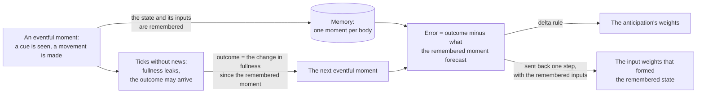

# How the agent works

This page explains every part of the agent in [`pcagent/agent.py`](../pcagent/agent.py), in words. The code
marks its parts as "Idea 1" to "Idea 12", and the same numbers are given here. The same parts as update rules
are in [equations.md](equations.md). For the short account, see the [README](../README.md); for how the design
relates to predictive coding, active inference and reinforcement learning, see [theory.md](theory.md).

- [The task in detail](#the-task-in-detail)
- [One tick, start to finish](#one-tick-start-to-finish)
- [Predicting the next senses from a sparse state](#predicting-the-next-senses-from-a-sparse-state)
- [The state is found by settling](#the-state-is-found-by-settling)
- [The input weights learn from the forecast's error](#the-input-weights-learn-from-the-forecasts-error)
- [The goal is a preferred range](#the-goal-is-a-preferred-range)
- [The movement is optimized, not selected](#the-movement-is-optimized-not-selected)
- [Anticipation, corrected in hindsight](#anticipation-corrected-in-hindsight)
- [The anticipation has a setpoint of its own](#the-anticipation-has-a-setpoint-of-its-own)
- [Regulators](#regulators)
- [The control switch](#the-control-switch)

## The task in detail

Time moves in ticks. On every tick the agent senses three things and returns a movement:

| Sense | What it is | Size |
|---|---|---|
| Sight | the cue, or blank | 2 or 4 numbers |
| Last movement | the direction the body just moved | 2 numbers |
| Fullness | one number per need | 1 or 2 numbers |

A trial lasts `delay + 1` ticks, and trials follow each other without a gap:

1. **Cue tick.** A direction is shown (east, north, west or south). The movement made on this tick is the answer.
2. **The wait.** Sight is blank for `delay` ticks, and movements do not change the outcome.
3. **The outcome.** At the end of the wait, fullness rises by an amount that depends on how close the answer was
   to the cue: all of the bite for the exact direction, half of it at 45 degrees off, none at 90 degrees or more.

Fullness leaks away on every tick. The agent's comfort band is 0.5 to 1.0, and the score is the share of bodies
whose fullness is inside the band. 32 bodies run in parallel and share one set of weights.

The agent is told none of the rules. It is not told that trials exist, how long the delay is or which tick
carries a cue, and it is never given its score. It is built with the comfort band, which is the band the score is
computed from. At any delay above 0, when the agent moves, no food arrives, and by the time it
does, the cue has been out of sight for `delay` ticks. One-tick prediction errors alone do not teach this agent
the task (see [the control](results.md#the-control)).

There are two games, both in [`pcagent/worlds.py`](../pcagent/worlds.py):

- **The cue game.** One need, one cue. Tested at delays of 0, 1, 2, 4, 8, 12 and 16 ticks.
- **The two-need game.** Food and water are offered in two different directions on every trial. The body can take
  one, a share of each when the two are 90 degrees apart, or neither. A bite can push a need above the band, so
  declining is sometimes right. The two needs leak at different rates that change every 20 trials. The best of
  14 reference policies that ignore the body's fullness (among them eight fixed schedules of eating, drinking
  and skipping) scores 0.44 at a delay of 1 and 0.43 at a delay of 2, the two delays tested.

## One tick, start to finish

One call to `Agent.step` is one tick. In order:

1. **Prediction error.** The senses are compared with what the previous state forecast for them. The difference
   is the prediction error. (The code's comments call it the surprise.)
2. **Learning from the last tick.** The forecast made on the previous tick is now known to be right or wrong,
   so the forecast weights and the input weights that formed the previous state learn from its error.
3. **Settling, twice.** The new state is found by a relaxation driven by the prediction error, the previous
   state, the movement and the anticipation fed back from the last tick. The first relaxation includes the goal
   and the second level's prediction, and gives the movement. The second, with that movement fixed and both left
   out, gives what the agent perceives.
4. **The second level.** It learns to predict the first level's state, then settles on the error of that
   prediction.
5. **Memory.** Every body adds this tick's change in fullness to its open outcome. A body for which this tick
   is news closes the moment it remembered, which corrects one forecast in hindsight, and stores the new one.

The movement from step 3 is returned.

## Predicting the next senses from a sparse state

The state is 256 units, each with a threshold that adapts toward the unit being active on about 6% of ticks. A
linear forecast reads the state and predicts the next tick's senses, and learns from its error by a normalized
[delta rule](https://en.wikipedia.org/wiki/Delta_rule). The agent also computes the change in its fullness since
the last tick and forecasts it like a sense. The last movement is known, so it is copied, not forecast.
*(Ideas 1 and 2; [in equations](equations.md#the-forecast-and-its-error))*

## The state is found by settling

On each tick the units are driven by the prediction error, by the previous state and by the movement. The
prediction error is this tick's senses minus what the previous state forecast for them (the forecast's constant
term is left out here; it is used when the weights learn and, for the change in fullness, where the comfort band
is read). Units whose input weights overlap inhibit each other. Forty small steps of this relaxation give the
state.

The relaxation runs twice per tick: once with the goal and the second level's prediction, which gives the
movement and the state the forecast reads, and once with neither and with that movement fixed, which gives the
state that the second level predicts and that memory stores.
*(Idea 3; [in equations](equations.md#settling))*

## The input weights learn from the forecast's error

The error is sent back one step through the forecast weights to the units that were active, and each of those
units changes its input weights by that error times the input it had. A second level of 64 units predicts the
first level's state in the same way and sends its prediction back down.
*(Ideas 4 and 5; [in equations](equations.md#learning-on-every-tick))*

Nothing in the agent is differentiated automatically. Every update is written out by hand, and a test checks
that the source never asks for a gradient.

## The goal is a preferred range

Outside the comfort band a cost grows with distance: the distance past the nearer edge, plus its square over the
band's width. Inside the band the cost is zero. The agent never receives this cost. It reads the *slope* of the
cost at the fullness it forecasts for the next tick, averaged over how uncertain that forecast is (it learns
the forecast's variance too). *(Idea 6; [in equations](equations.md#the-two-preferences))*

## The movement is optimized, not selected

While the state settles, the movement follows the gradient of the agent's preferences. The slope of the cost is
carried through the forecast weights to the active units, which says which of them would bring the forecast
fullness back toward the band if they were more active. From those units it is carried through the movement's
own input weights, which gives a direction, and the movement turns toward it: fast early in the settle, slowly
late. Nothing pushes the units themselves, so the state feels the goal only through the movement it settles on.

There is no list of candidate movements, no search and no sampling, and no distribution over movements is
formed. The movement is a point estimate, found by approximate gradient descent on the agent's preference cost
through its own learned forecast: the gradient through a learned forward model (Jordan and Rumelhart, 1992)
sets the action itself, with no controller in between (see [theory.md](theory.md#active-inference)). The gradient is approximate. It treats the inhibition
between units, the hold and the thresholds as fixed.

The movement's input weights do double duty. Forward, the movement drives the state through them. Backward,
their transpose carries the push to the movement. They learn from prediction errors like the other input
weights, so the mapping from a cue to a movement is learned there and in the forecast weights, not in a separate
policy. No noise is added to the movement: the first movements are whatever the random initial weights produce.
*(Idea 7; [in equations](equations.md#the-movement). Idea 8 is a detail of the forecast of the change in
fullness: it reads the state with its mean over the active units removed.)*

## Anticipation, corrected in hindsight

This is the part that reaches across the delay.

- **One more prediction.** One more set of weights reads the state and predicts the anticipation, `a = Ca · z`.
  Its value is fed back into the state on the next tick, through input weights of its own. *(Idea 9)*
- **Memory holds one moment.** A tick is eventful for a body when its sight or its movement was news: predicted
  neither by the forecast nor by the running average. The fullness is not counted as news. Each body remembers
  its latest eventful moment: the state, the inputs that formed it, and its fullness. The agent is not told
  which ticks matter. In these two games the body does exactly what it is told, so its movement is never news,
  sight is blank between cues, and the eventful ticks are exactly the cue ticks (a test checks this). At a delay
  of 0 a cue arrives on every tick, and nearly every tick is eventful. *(Idea 10)*
- **The outcome is the change in fullness.** Between two eventful moments, each body adds up its changes in
  fullness. The sum is the outcome `G`: the fullness at the next eventful moment minus the fullness at the
  remembered one. It holds what leaked away over the interval and whatever was eaten.
- **The forecast of an outcome has two parts.** One is a line read from the fullness at the remembered moment,
  `slope × fullness + offset`, fitted across the bodies to the outcomes themselves. It carries what the fullness
  alone tells, which is mostly the leak and the usual meal. It is a baseline that needs many bodies: one body
  alone could not fit it. The other is the anticipation, read from the
  remembered state. It is left with what the line cannot tell: what this cue and this movement change.
- **Hindsight sets a target.** When the next eventful moment arrives, the error is `G` minus the line minus
  `a(remembered state)`, with the anticipation read from the remembered state by the weights as they are now.
  The anticipation's weights step by that error with the delta rule, at three times the forecast's rate and
  with a limit on the step. The same error, sent back one step, corrects the input weights that formed the
  remembered state, using the remembered inputs; the input weights from the anticipation take the same step,
  with the anticipation that was fed in at that moment. The line moves a twentieth of the way toward the
  least-squares fit of the outcomes, across the bodies that close a moment on that tick. No other weight is
  corrected.
- **What is read when the agent acts.** The remembered moment is never read when the agent acts. Two running
  averages kept beside it are read instead: how much outcomes vary, and how well the forecast predicts them.

"Hindsight" names this one correction. It is not hindsight experience replay, and it is not hindsight credit
assignment in the sense of Harutyunyan et al. (2019); see [theory.md](theory.md#reinforcement-learning).
*([In equations](equations.md#events-outcomes-and-the-hindsight-error))*

## The anticipation has a setpoint of its own

The comfort band is read on `fullness + forecast change`, one tick ahead. The anticipation adds a second read,
with a point as its goal: the fullness expected at the next eventful moment, `fullness + line + a`, should sit
in the middle of the band. Its error is counted in half-widths of the band. A movement that would give up the
next meal is therefore already wrong when it is made, and one that would overfill is wrong too.

The forecast behind this read is trained only at eventful moments, but it is read on every tick, from the state
as it settles.

The push that turns the movement has two terms. The first is the band's slope, through the weights that
forecast the next change in fullness. Its weight is the one-tick forecast's share of the two forecasts' skill,
`(s1 + 0.05) / (s1 + sG + 0.05)`, where a skill is the fraction of a target's variance its forecast explains.
The second is the setpoint's error, through the anticipation's weights, multiplied by a fixed gain of 8.
*(Idea 11; [in equations](equations.md#the-two-preferences))*

## Regulators

Five regulators keep learning stable *(Idea 12; [in equations](equations.md#gains-and-running-statistics))*:

- an attention gain (1 to 10) on the prediction error of inputs whose error would change the agent's other
  forecasts (it is not an estimate of precision, and it is fixed at 1 for the fullness);
- one learning-rate gate (1 to 10) that opens when the outcome forecast's error is far from its usual size;
- a hold, set per body on each tick, that keeps up to 90% of the first level's previous potentials through
  ticks with smaller prediction errors than usual;
- first-level thresholds that weigh each tick by the size of its prediction errors;
- a limit on what one eventful moment can do to the three running averages of the outcome forecast's squared
  error: each takes a moment's sample at no more than 10 times its own value, so a single wild outcome cannot
  wipe out the forecast's measured skill.

## The control switch

Switching the hindsight correction off is one argument, `Agent(..., hindsight=False)`. Everything else stays the
same: memory still records moments and outcomes, but corrects no weight, so the anticipation's weights and the
line stay at zero and the second preference has nothing to act through. The learning-rate gate keeps running,
on the size of the outcomes themselves. The gray curves in the figures are that agent, and
[the control](results.md#the-control) reports what it learned and what that does and does not show.
